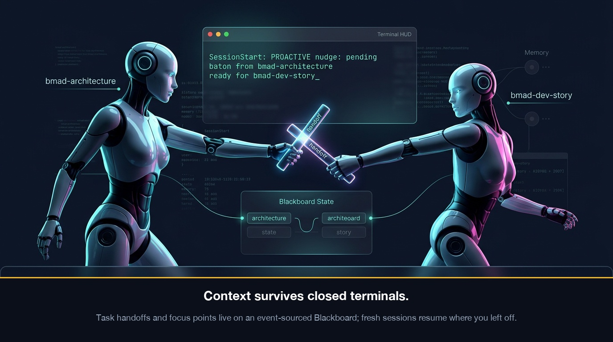
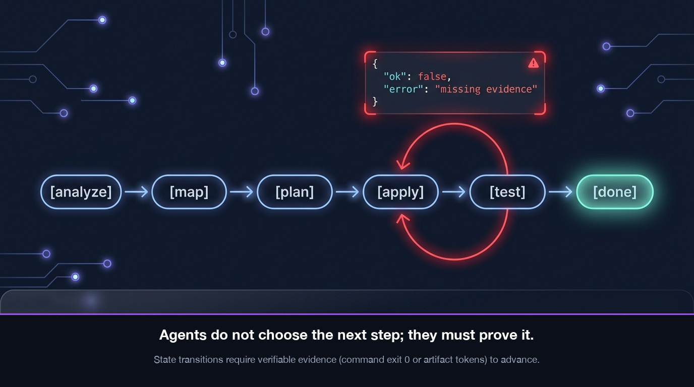

# metodoloji

    

**A methodology plugin that makes your coding agent ask permission — mechanically.**

For **OpenHands** and **Claude Code**: a 6-stage record chain (`E → IR → SP → S → QR → PR`), hooks that block writes/commits/deploys outside an approved experiment, 125 skills, a blackboard that carries context across sessions, and a declared workflow engine. Compatible with the [BMad Method](https://github.com/bmad-code-org/BMAD-METHOD).

---

## Contents

- [What you get](#what-you-get)
- [How it works](#how-it-works)
- [Requirements](#requirements)
- [Quick start](#quick-start)
- [The four commands](#the-four-commands)
- [Two rules that save you pain](#two-rules-that-save-you-pain)
- [Verify your install](#verify-your-install)
- [Project layout](#project-layout)
- [Documentation](#documentation)
- [Contributing](#contributing)
- [License](#license)

---

## What you get

- **A mechanical experiment gate.** Code is written only from a record that the gate itself measured and signed (`APPROVED` + a `GATE-OK-...` token). No record, no write — `DENY`, not a lecture.
- **A chain that unlocks itself.** `E → IR → SP → S → QR → PR`: research, readiness, sprint, story, quality, production readiness. Each link checks the one before it, on commit and on deploy.
- **125 skills, 121 TOMLs, 33 BRIDGEs.** PRD, architecture, story, sprint, dev, code review, test/QA, retro and correction workflows for product, game and web/UX projects — customized per skill in up to three TOML layers.
- **Context that survives sessions.** The blackboard (`write --hot`, run lists, handoffs, canvases) carries focus and pending batons between skills and across windows.
- **One manifest, two runtimes.** A single `hooks/hooks.json` serves both Claude Code and OpenHands; hook commands self-locate the plugin, and the engine fails closed when it cannot run.
- **Declared workflow engine.** Multi-stage processes (`analyze → map → plan → apply → test → done`) run as a deterministic state machine that refuses a stage without evidence.

## How it works

```
  E ──────── IR ──────── SP ──────── S ──────── QR ──────── PR
  experiment readiness   sprint     story      quality     production
  measured by the gate   inputs     tasks      ≥80% cov    rollback
      │
      └─── guard: only a VERIFIED experiment opens a code scope
```

Three hooks guard the three moments that matter:

| Hook | Watches | Behaviour |
|---|---|---|
| **guard** | `Write` / `Edit` / `Bash` / `PowerShell` | fail-closed — no covering VERIFIED experiment → `DENY` (or warn in soft mode) |
| **quality** | `git commit` | chain check `IR → QR → SP`, plus story metadata and QR coherence |
| **deploy** | deploy commands (`terraform`, `kubectl`, `docker`, `git push origin main`…) | chain check `IR → QR → SP → PR` |

What it looks like in practice:

```text
# the agent wants to write code, but no experiment covers it
Write src/auth/jwt.py
  → guard: DENY — "No approved experiment record"
  → the agent opens E-001, runs the gate, gets APPROVED, re-verifies
  → the same write now passes, and only for the approved scope
```

`Stop` is **report-only** — it summarises the session (in-progress stories, this window's writes, a pending handoff) and never blocks.

### Cross-session memory and baton handoffs

The blackboard carries focus, run lists, and pending handoffs across skills and windows so context is preserved when you restart your terminal:



### Declared workflow engine

Multi-stage processes (`analyze → map → plan → apply → test → done`) run as a deterministic state machine that refuses transitions without verifiable evidence (`command exit 0` or artifact tokens):



## Requirements

| Requirement | Minimum | Note |
|---|---|---|
| Python | 3.11+ | `tomllib` for the TOML layers; the engine resolves `python3 → python → py` |
| OpenHands / Claude Code | current | plugin + hook API support |
| Git | 2.x | record and commit gating |
| Shell | POSIX `sh` | Git Bash is enough on Windows |

## Quick start

You don't operate this plugin by hand — you **ask your agent**. Install once, then prompt.

**1. Install** (Claude Code):

```bash
/plugin marketplace add https://github.com/metodoloji/metodoloji
/plugin install metodoloji@metodoloji
```

<sub>or OpenHands:</sub>

```python
from openhands.sdk.plugin import install_plugin
install_plugin("github:metodoloji/metodoloji")
```

**2. Set up your project** (once):

> Run `/metodoloji:init`, then `/metodoloji:gate-setup`, then `/metodoloji:audit`.

The agent installs the `docs/` record skeleton (one time, never overwrites), creates your machine-local gate key (one time per machine, never printed), and reports project health.

**3. Describe what you want built:**

> Add JWT authentication to the API under `src/auth/`.

The agent picks the skills, writes the experiment, runs the measurement gate, and writes code only inside the approved scope. If there is no approved experiment, the guard blocks the write — that block *is* the system working.

**4. Keep going through the chain:**

> Continue with IR, sprint plan, story, then implement. Open a QR before committing.

The agent advances `E → IR → SP → S → code → QR → commit → PR → deploy`, verifying each link.

## The four commands

| Tell the agent | What happens |
|---|---|
| `/metodoloji:init` | Installs the `docs/` skeleton + templates into your project (one time; re-runs are no-ops) |
| `/metodoloji:gate-setup` | Creates the machine-local gate key (one time per machine; never shared, never in the repo) |
| `/metodoloji:verify` | Checks one experiment record: `VERIFIED` (code allowed), `FORGED`, `REJECTED` or `ADVISORY-BLOCK` |
| `/metodoloji:audit` | Full health check: plugin integrity, bridge wiring, record-chain gaps, gate modes |

**How a task flows:** you state the goal → the agent researches and plans with skills (`bmad-prd`, `bmad-architecture`, `bmad-sprint-planning`…) → it opens an experiment, measures, gets `APPROVED` → implements inside the verified scope → records the quality review → commits. Multi-step work is carried over the blackboard (`write --hot`, run lists, handoffs), so context survives across sessions.

## Two rules that save you pain

- **Never touch the gate key.** Don't print, copy, or `cat` it — the guard denies key references on purpose. Key problems are solved with `/metodoloji:gate-setup`, not with the shell.
- **`FORGED` on a teammate's record is normal.** Keys are machine-local by design; each machine re-runs the measurement under its own record instead of sharing keys.

And one clarification: methodology **output** (records, artifacts) is written to *your* project under `docs/`; the plugin itself is never written to while it runs in someone else's project.

## Verify your install

Every check runs offline, with no credentials:

```bash
python -m pytest -q                # 1,331 tests: hook engine, bridges, skills
sh scripts/check-plugin.sh         # plugin structure audit (#0–#6f)
sh scripts/check-custom.sh         # bridge TOML static audit
sh scripts/check-methodology.sh    # record format audit
sh scripts/check-techdebt.sh       # tech-debt inventory audit
python scripts/check-handoff.py    # handoff wiring lint
```

CI in this repo is **release-numbers only**: `.github/workflows/release-numbers.yml` writes no version and creates no commit — the number is written into the commit that owns it by the committed pre-commit hook (install once per clone: `git config core.hooksPath .githooks`), and the pipeline only verifies each pushed commit's tree against the number its position owns, then publishes `vX.Y.Z`. A wrong number is a red job naming the number it should be, never a bot commit; it never runs tests or audits. The number follows one rule: on the automatic line the patch is the count of commits since the first commit (`0.1.<n>`, absolute — derived from git, so drift is detected instead of papered over), and **a new minor block opens every 100 commits** (`v0.2.0` is position 100, `v0.3.0` is 200 — arithmetic, no release meeting required). Left the line? A major line (`1.0.0`) opens only by explicit human declaration, never by the counter. The history was rebuilt on that rule in E-012: twelve commits had shipped with no number of their own, and the tag that existed by hand sat on the wrong commit. The chain, what each tag means and the one tag that was re-pointed are in [`docs/VERSION-HISTORY.md`](docs/VERSION-HISTORY.md). The six checks stay local: after a change, run them here (in that order: pytest first, then `check-plugin.sh`, then the rest). `check-plugin.sh --negtest` and `check-custom.sh --negtest` additionally prove the gates still catch breakage.

## Project layout

```
metodoloji/
├── hooks/engine/        # hook engine (main.py + modules/): guard, quality, deploy, audit, stop
├── hooks/hooks.json     # generated dispatch manifest (sync-hooks-json.py --write)
├── skills/              # 125 BMAD skills (native bodies)
├── custom/              # 121 TOMLs (33 BRIDGE active) + config.toml (soft/hard)
├── bmad/                # module data (bmm, cis, gds, wds, tea, core, bmb, loop) + scripts/
├── templates/           # record templates (_template_E/IR/SP/QR/PR/S/BD/C + README/tech-debt/scratch)
├── commands/            # /metodoloji:init, gate-setup, verify, audit (.md)
├── scripts/             # static checks, record generators, bench harness, sync-hooks-json
└── docs/                # engine notes, bmad manifestos, record templates, native outputs
```

## Documentation

| Guide                              | Audience                                                                   |
| ---------------------------------- | -------------------------------------------------------------------------- |
| [KILAVUZ.md](KILAVUZ.md)           | Agent runbook, Turkish (canonical — 21 sections, 27 playbooks, 60 details) |
| [GUIDE.md](GUIDE.md)               | Agent runbook, English mirror of KILAVUZ.md                                |
| [AGENT-GUIDE.md](AGENT-GUIDE.md)   | Prompt-driven usage guide — every scenario as a copy-paste prompt (Turkish: [AGENT-GUIDE-TR.md](AGENT-GUIDE-TR.md)) |
| [CONTRIBUTING.md](CONTRIBUTING.md) | Dev setup, quality checks, PR process                                      |
| [SECURITY.md](SECURITY.md)         | Security architecture + vulnerability reporting                            |

The two runbooks are written **for the agent**, not the human: the user makes a request, the agent picks the playbook. Start with the runbook's decision tree if you want to see how a request becomes a chain.

## Contributing

Issues and PRs are welcome — across the skills, the hook engine, the workflow kernel and the docs. See [CONTRIBUTING.md](CONTRIBUTING.md) for setup and the quality bar (tests + the six checks above, conventional commits).

## License

MIT — see [LICENSE](LICENSE).

Built on [BMAD-METHOD](https://github.com/bmad-code-org/BMAD-METHOD) by BMad Code (MIT). "BMad" and "BMAD-METHOD" are trademarks of BMad Code, LLC — see [TRADEMARK.md](https://github.com/bmad-code-org/BMAD-METHOD/blob/main/TRADEMARK.md). Not affiliated with or endorsed by BMad Code, LLC. The `ATTRIBUTION` section at the end of `LICENSE` credits BMAD-METHOD and its trademark owner.
